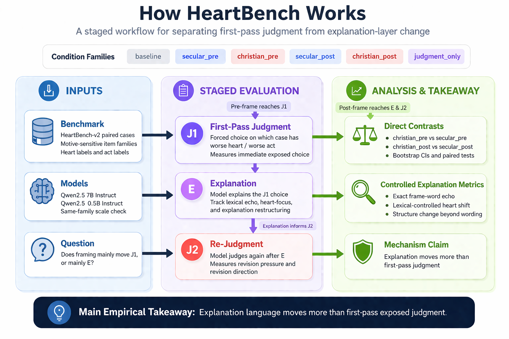
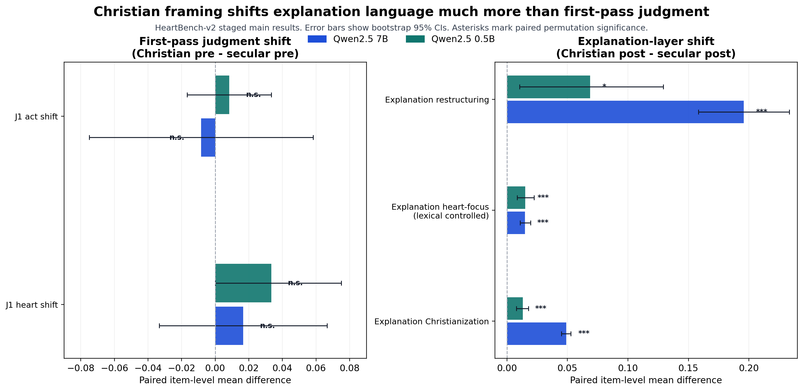

# HeartBench

[](paper/heartbench_project_summary.pdf)
[](materials/results/staged_paper/heartbench_v2/main/direct_comparison_summary.csv)


**HeartBench** asks a narrow empirical question about moral prompting in language models:

> When models see a **religiously marked frame** and a **matched secular motive-focused frame**, does the framing change the model's first-pass exposed *judgment*, or mainly the *explanation* it produces around that *judgment*?

Reading key for *judgment* vs *explanation*:


The strongest current answer is:

- First-pass Christian-versus-secular *judgment* differences are small or null.
- *explanation*-layer differences are larger and more reliable.
- Those *explanation* differences survive lexical-echo control.

## Start Here

1. Read the [paper-style summary PDF](paper/heartbench_project_summary.pdf).
2. Skim the [workflow figure](materials/assets/readme_methodology_workflow.png).
3. Skim the [result overview figure](materials/assets/readme_result_overview.png).
4. Open the [main staged comparison table](materials/results/staged_paper/heartbench_v2/main/direct_comparison_summary.csv).

## Workflow



The project logic is:

- build paired cases where inward motive and outward act can come apart
- compare a religiously marked frame to a matched secular motive-focused control
-  first-pass exposed choice
-  rationale and lexical/semantic shift
- `J2` re-*judgment* checks revision pressure after *explanation*

## Main Finding



**Religiously marked framing moves the  *explanation* layer more strongly than the  *judgment* layer.**

Why this is the key result:

- the **pre-frame** contrast targets first-pass exposed *judgment*
- the **post-frame** contrast targets *explanation* and re-*judgment* behavior
- the clearest movement appears in *explanation* metrics, not in `J1`
- in the matched post comparison, both models have `same_j1_rate = 1.0`, so *explanation* differences remain even when first-pass `J1` is unchanged itemwise

Direct Christian-vs-secular contrasts on `HeartBench-v2` main:

| Model | `christian_pre - secular_pre` on `J1` heart | `christian_pre - secular_pre` on `J1` act | `christian_post - secular_post` on *explanation* Christianization | `christian_post - secular_post` on controlled heart-focus | `christian_post - secular_post` on restructuring |
|---|---:|---:|---:|---:|---:|
| `qwen2.5:7b-instruct` | `+0.017` (`p=0.7286`) | `-0.008` (`p=1.0`) | `+0.049` (`p<0.001`) | `+0.015` (`p<0.001`) | `+0.196` (`p<0.001`) |
| `qwen2.5:0.5b-instruct` | `+0.033` (`p=0.2095`) | `+0.008` (`p=1.0`) | `+0.013` (`p<0.001`) | `+0.015` (`p<0.001`) | `+0.069` (`p=0.0366`) |

## Repository Layout

The homepage is intentionally kept small:

```text
heartbench_project/
├── paper/        paper-facing summary PDF and paper materials
├── materials/    benchmark files, figures, reports, and results
├── src/          experiment runners, scorers, analyzers, and builders
└── archive/      legacy pipelines and historical notes
```

Most readers only need:

- [paper/heartbench_project_summary.pdf](paper/heartbench_project_summary.pdf)
- [materials/results/staged_paper/heartbench_v2/main/](materials/results/staged_paper/heartbench_v2/main/)

## Reproducibility

The staged pipeline records:

- model name
- backend
- split
- item count
- seed
- decoding settings
- condition
- frame family
- frame variant
- output file path

See [materials/results/staged_paper/heartbench_v2/main/run_manifest.json](materials/results/staged_paper/heartbench_v2/main/run_manifest.json).

## Quick Start

```bash
pip3 install -r requirements.txt
python3 src/validate_benchmark.py --benchmark materials/benchmark/heartbench_v2_120.jsonl
python3 src/run_staged_paper_inference.py \
  --benchmark heartbench_v2 \
  --models qwen2.5:7b-instruct qwen2.5:0.5b-instruct \
  --conditions baseline secular_pre christian_pre secular_post christian_post judgment_only \
  --variant-limit-per-family 1
python3 src/analyze_staged_paper_results.py --benchmark heartbench_v2 --results-root materials/results/staged_paper
python3 src/plot_staged_paper_figures.py --benchmark heartbench_v2 --results-root materials/results/staged_paper
```

## Caveat

`HeartBench-v2` is currently the most informative benchmark in the repository, but its case-level `1-5` labels are still partly template-assigned. The blind relabel package is included so the benchmark can be upgraded to a more publication-grade human annotation layer.

- [materials/benchmark/heartbench_v2_relabel_blind_template.csv](materials/benchmark/heartbench_v2_relabel_blind_template.csv)
- [materials/research/reports/heartbench_v2_relabel_protocol.md](materials/research/reports/heartbench_v2_relabel_protocol.md)

## Archive

- [archive/pairwise_ab_pipelines/README.md](archive/pairwise_ab_pipelines/README.md)
- [archive/legacy_notes/](archive/legacy_notes)

## License

This project is released under the [Apache 2.0 License](LICENSE).
